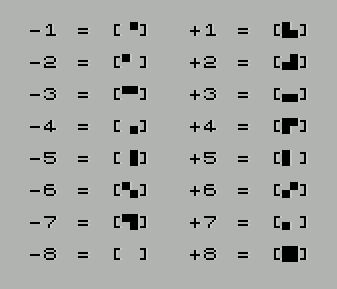
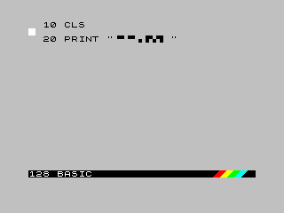

# Graph Characters in Sinclair Basic

## 1. Special characters format

Special characters format
Format is compatible with tool called bas2tap.

UDG characters
{A}, {B}, ..., {T}

copyright symbol
{(C)}

pound symbol
{pound}

mosaic graphics symbols
{-1}, {-2}, ..., {-8}
{+1}, {+2}, ..., {+8} (mosaic graphics symbol with shift)



control (invisible) characters for text attributes settings
{INK c}
{PAPER c}
{FLASH b}
{BRIGHT b}
{INVERSE b}
{OVER b}
{AT y,x}
{TAB t}

(c = color number; b = value 0 or 1; y,x = coordinates in text mode; t = tab num)

## 2. Create the program in a normal editor

```basic
10 CLS
20 PRINT "{-1}{-2}{-3}{-4}{-5}{-6}{-7}{-8}"
```

And save it in a hello.bas file

## 3. Pass the ASCII file to tap

```
$ bas2tap graph.bas
```

This will generate the hello.tap file

## 4. Execute the program

Load it in the emulator and run it.

NOTE: In the BASIC editor of the Spectrum emulator, you can type "RUN" to run the program

The program will show this in the 128k Basic:



