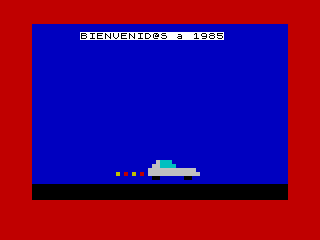

# ZX85

A simple program with some instructions in Sinclair Basic

```url
https://www.youtube.com/watch?v=Jxbo5x7A2dY&list=PLahTYedss6ykZnODwHk5bRtAriasF_0wf&index=3
```

## 1. Pass the ASCII file with the basic program to tap

```
$ bas2tap zx85.bas
```

## 2. Execute the program

Load the program in the emulator (128k emulator) and execute from 128k basic with __run__

You would see:



You can delete the program win the command __new__